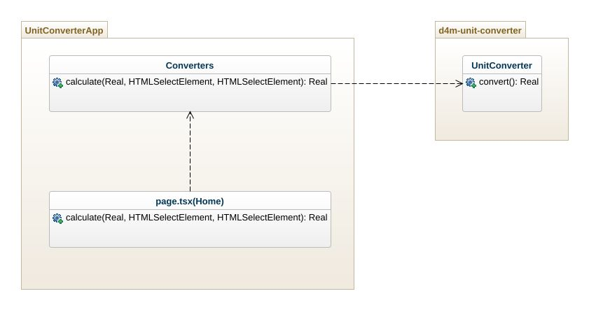

<h1>
Software Requirements Specification (SRS)
</h1>

[< Return](./README.md)

### Table of Contents

  1. Introduction
  2. Overall Description
  3. Specific Requirements
  4. Non-functional Requirements
  5. Conclusion
---

### 1. Introduction
###### 1.1 Purpose
This document specifies the software requirements for the Unit Converter App, aiming to provide a detailed guide for developers, stakeholders, and users.
###### 1.2 Scope
  The Unit Converter App provides an online platform for users to effortlessly convert between metric and imperial units, as well as between the three most commonly used temperature scales.
### 2. Overall Description
###### 2.1 Problem Statement
  It can be challenging to convert between different units and temperature scales quickly and accurately.
###### 2.2 Solution
  The Unit Converter App aims to offer a simple yet robust online interface for unit and temperature conversions.
###### 2.3 Architecture
  Built using React and TypeScript, the app adopts a client-side model for quick conversions.
  
###### 2.4 Features
  * Effortless conversion interface
  * Online accessibility

###### 2.5 Target Audience
  General public, students, professionals in science and engineering fields.

###### 2.6 The Competition
  There are multiple online unit converters, but this app aims for simplicity and user-friendliness without compromising on accuracy.

###### 2.7 Techniques
  The app is developed using Next as a full stack framework and relies on TypeScript for type safety and easier maintainability.

### 3. Specific Requirements
###### 3.1 Functional Requirements
  * **Conversion Types:** Users can select between 'Length' and 'Temperature' for conversions.
  * **Input:** Users can input the numeric value in a dedicated input field.
  * **Unit Selection:** Users can select the unit to convert from and the unit to convert to via dropdown menus.
  * **Output:** The converted value will be displayed in a read-only input field.
  * **Auto-calculation:** The conversion is performed automatically whenever any value or unit changes.

###### 3.2 Data Requirements
  Numeric input should conform to a specific pattern (e.g., floating-point numbers).

### 4. Non-functional Requirements
###### 4.1 Usability
  The interface should be intuitive.

###### 4.2 Performance
  Conversion should be completed in real-time as users input values or change units.

###### 4.3 Security
  The app should validate all input to ensure it conforms to expected numeric formats.

### 5. Conclusion
This SRS provides a comprehensive guide for the development and deployment of the Unit Converter App, aiming to fulfill the identified needs and preferences of its target audience while differentiating itself from competitors through its features and user interface.