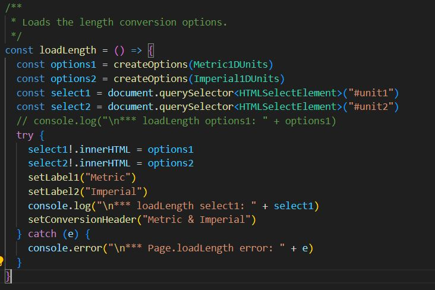
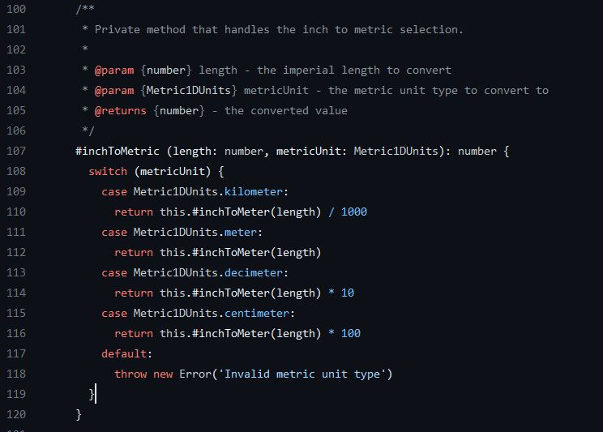
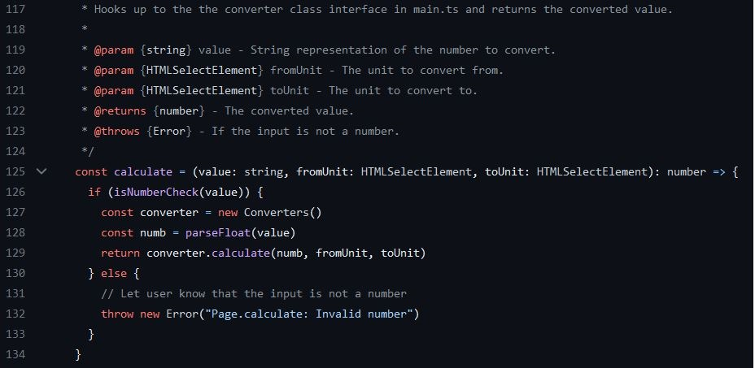
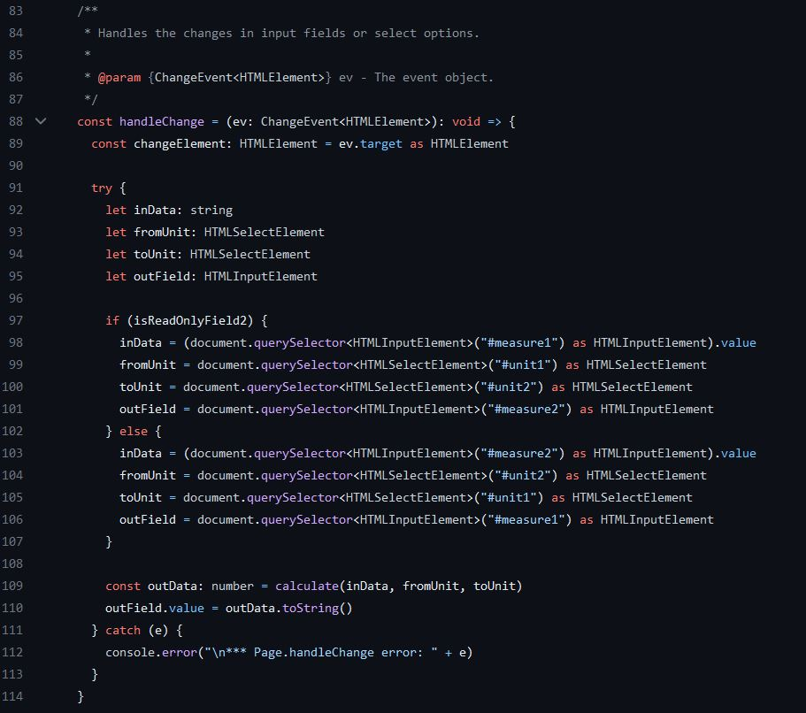
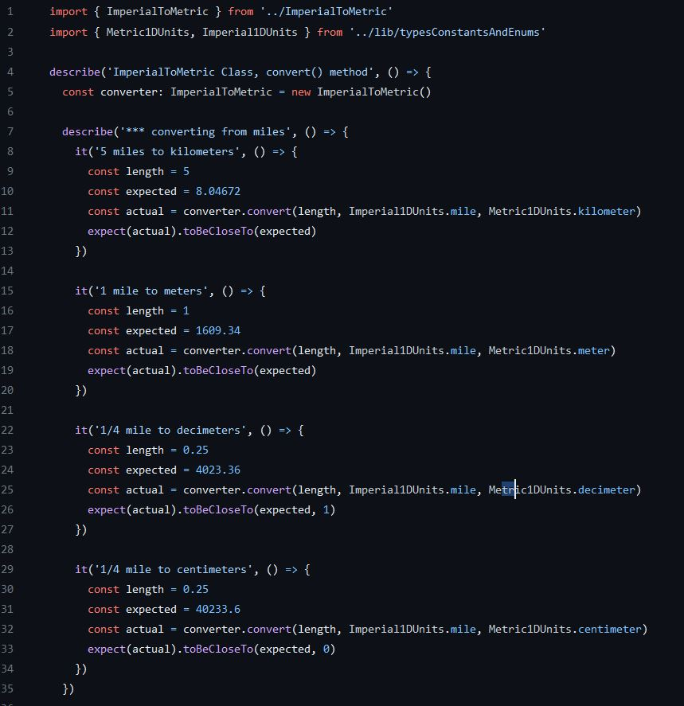
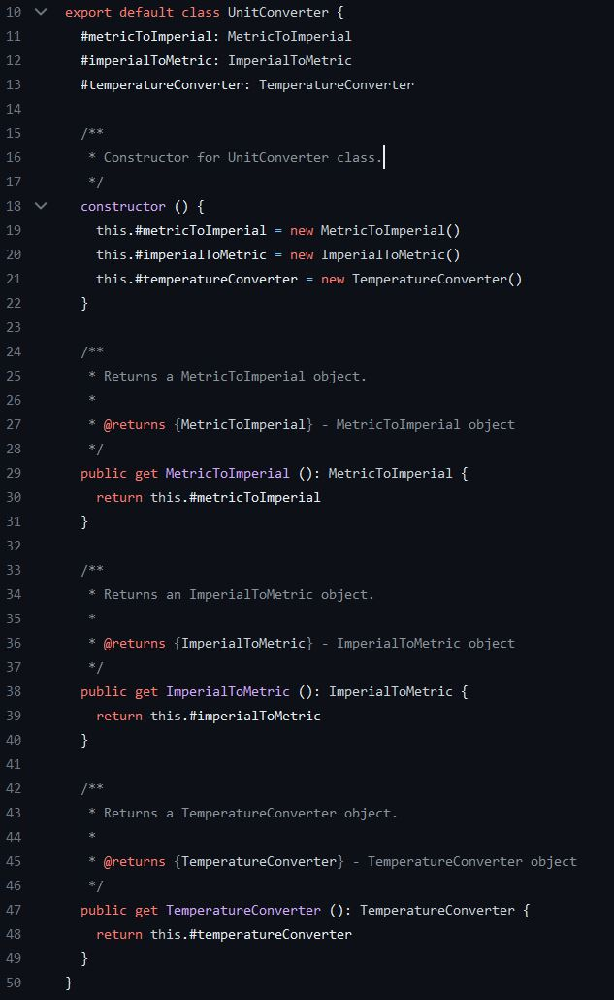

<h1><center>Reflection L3 1DV610 - 2023</center></h1>

## Table of Contents
1. [Meaningful Names](#1-chapter-2---meaningful-names)
2. [Functions](#2-chapter-3---functions)
3. [Comments](#3-chapter-4---comments)
4. [Formatting](#4-chapter-5---formatting)
5. [Objects and data structures](#5-chapter-6---objects-and-data-structures)
6. [Error handling](#6-chapter-7---error-handling)
7. [Boundaries](#7-chapter-8---boundaries)
8. [Unit tests](#8-chapter-9---unit-tests)
9. [Classes](#9-chapter-10---classes)
10. [Systems](#10-chapter-11---systems)

---

**Note:** 
It feels a bit awkward to include chapters that hasn't been included in any lectures. As of this writing there hasn't been any lecture on chapters 9 through 11 and onwards.

### 1. Chapter 2 - Meaningful names

I believe that choosing meaningful names is a foundational element of good coding practices. Finding the right names can be a difficult task, but it is crucial for enhancing code readability and maintainability. The time spent on carefully selecting names for methods, classes, and attributes is an investment that pays off in the long run. In my opinion, this attention to detail is invaluable for any programmer who aims for high-quality code.

In this example, the original name "TemperatureTypes" was replaced with "TemperatureUnits," which more accurately communicates both the intent and the content of the enumeration. This change enhances readability and makes the code more self-explanatory, thus aligning with best practices for naming conventions.


### 2. Chapter 3 - Functions

The book advocates that functions should perform only one task, have descriptive names, and ideally be niladic (having no arguments), the image below serves as a fitting example. Although the function illustrated does have one argument, making it monadic, nor does is it a nice verb/noun pair but it still is quite descriptive and it still adheres to the principles outlined in the book.


Contrary to the guidelines in book, I believe that a function performing only a single task can actually complicate code readability. This approach often leads to a cascade of method calls, requiring you to navigate through multiple functions before arriving at one that performs some form of action. Additionally, I also favor encapsulating multiple arguments into a single class, as I find this practice reduces the likelihood of errors and enhances code organization.

### 3. Chapter 4 - Comments
In line with the principles articulated in Chapters 2 and 3 of the book the use of descriptive names should minimize the need for comments. By employing meaningful names and adhering to the guideline that a function should perform only one task, the code becomes largely self-explanatory, thereby reducing the scope for extensive commenting. Although I disagree with the single-responsibility rule for functions, I do practice restrained use of comments. My tend to use comments is to disable code lines, especially those like ```console.log,``` which are mainly useful during the development phase. I find having such lines readily available beneficial when code modifications or refactoring are required. Regarding legal comments, there's little room for negotiation; if they are mandated, they must be included. Finally, documenting both public and private APIs enhances their usability, further contributing to the code's clarity and maintainability. Personally, I use comments for three specific purposes: to clarify code when necessary, to disable code lines used exclusively during development, and to comply with mandatory coding standards or rules.



### 4. Chapter 5 - Formatting
Readability in code is not just important, it simplifies the writing process as well, based on my experience. This is why I find the single-line-break limitation, imposed by our current linting rules, to be constrictive. In particular, the numerous comments required by the LNU linting rules for JavaScript seem to impede the vertical flow between conceptual blocks, in my view. I often prefer more generous vertical spacing to enhance readability. If code follows the other guidelines set forth by "Clean Code," then file size becomes a secondary concern, as long as it doesn't become excessive. To me, files serve to compartmentalize concerns. While editors can limit horizontal width, I tend to favor a denser horizontal layout, especially around control statements like "if." Proper indentation significantly enhances code overview and readability, as demonstrated in earlier code examples. Then the discussion whether tab should be two or four characters will probably go on, at least, for the rest of my life. :)

### 5. Chapter 6 - Objects and data structures
The key points are expose behavior and hide data. I find this chapter quite  confusing and I prefer to see classes as keepers of a specific type of data and to contain all functionality that you need to manipulate that data. So, I am sitting firmly in-between the two concepts discussed "Data Structures" and "Objects". If other classes has the same functionalities then create an abstract class to handle that functionality so we can avoid duplication of code as demonstrated in the following code snippet.



In this code snippet from the app's page.tsx, the Law of Demeter is demonstrated. On line 127, the calculate method instantiates an object called converter and then invokes its calculate method on line 129. Although triadic methods are generally not recommended, in this case, it's necessary.



### 6. Chapter 7 - Error handling
In the preceding code snippet, we see an implementation of robust error handling. The function evaluates the value argument to determine if it can be converted to a numeric value. If the conversion is not possible, it throws an exception that encapsulates details about its origin and the nature of the error. One key takeaway from this chapter that I intend to implement in my future work is the principle of 'Write your try-catch-finally statements first.' This concept has also shaped my approach to method design, emphasizing the importance of clearly defining what a caller can expect from a method, regardless of any issues that may arise within the 'try' block. In the following example, any exceptions thrown within the 'try' block are simply logged to the console.




### 7. Chapter 8 - Boundaries
One essential takeaway from this chapter for me is the importance of encapsulating third-party APIs, as well as my own APIs, within domain-specific classes. This approach allows for greater control over the boundary interfaces and offers the flexibility to swap out underlying modules or APIs without impacting the broader codebase. I encountered a similar lesson in another course, 1DV607. I'll share the code from my 'Converters' class to illustrate this principle. In this example, I've managed the boundary by wrapping the external library, 'd4m-unit-converter,' in an application-specific class. This encapsulation makes it possible to replace 'd4m-unit-converter' with another module without any adverse effects on the existing application.

```
/**
 * The interface between the UI and the d4m-unit-converter module.
 */
class Converters {
  #converter: UnitConverter = new UnitConverter()
  constructor() {}

  public calculate(value: number, fromUnit: HTMLSelectElement, toUnit: HTMLSelectElement): number {
    // console.log("calculate: " + value + " " + fromUnit + " " + toUnit)

    try {
      const type = this.#checkType(fromUnit.value.toString())
      if (!this.#checkType(toUnit.value.toString())) {
        throw new ToUnitError("\nCalculate: " + toUnit.toString() + " Invalid unit type");
      }

      // console.log("\ncalculate: type " + type)
      if (type === "temperature") {
        return this.#temperatureConversion(value, fromUnit, toUnit)
      } else if (type === "metric") {
        return this.#lengthMetricToImperialConversion(value, fromUnit, toUnit)
      } else if (type === "imperial") {
        return this.#lengthImperialToMetricConversion(value, fromUnit, toUnit)
      }
      else {
        throw new FromUnitError("\nMain.Converters: " + type || "no type" + " Invalid unit type")
      }
    } catch (e: any) {
      throw new Error(e.message + "\nMain.Converters: Calculation failed.")
    }
  }

  #temperatureConversion(temperature: number, fromUnit: HTMLSelectElement, toUnit: HTMLSelectElement): number {
    try {
      if (fromUnit.value === toUnit.value) {
        return temperature
      }
      const converter = this.#converter.TemperatureConverter
      return converter.convert(temperature, TemperatureUnits[fromUnit.value.toString() as keyof typeof TemperatureUnits],
        TemperatureUnits[toUnit.value as keyof typeof TemperatureUnits])
    } catch (e: any) {
      throw new Error(e.message + "\nMain.#temperatureConversion\nTemperature conversion failed.")
    }
  }

  #lengthMetricToImperialConversion(length: number, fromUnit: HTMLSelectElement, toUnit: HTMLSelectElement): number {
    try {
      const converter = this.#converter.MetricToImperial
      return converter.convert(length,
        Metric1DUnits[fromUnit.value as keyof typeof Metric1DUnits],
        Imperial1DUnits[toUnit.value as keyof typeof Imperial1DUnits])
    } catch (e: any) {
      throw new Error(e.message + "\nMain.#lengthMetricToImperialConversion\nMetric to Imperial conversion failed.")
    }
  }

  #lengthImperialToMetricConversion(length: number, fromUnit: HTMLSelectElement, toUnit: HTMLSelectElement): number {
    // console.log("\nlengthImperialToMetricConversion: " + length + " " + fromUnit + " " + toUnit)
    try {
      const converter = this.#converter.ImperialToMetric
      return converter.convert(length,
        Imperial1DUnits[fromUnit.value as keyof typeof Imperial1DUnits],
        Metric1DUnits[toUnit.value as keyof typeof Metric1DUnits])
    } catch (e: any) {
      throw new Error(e.message + "\nMain.#lengthImperialToMetricConversion\nImperial to Metric conversion failed.")
    }
  }

  #checkType(value: string): string {
    // console.log("\checkType: " + value)
    if (value in Metric1DUnits) {
      return "metric";
    } else if (value in Imperial1DUnits) {
      return "imperial";
    } else if (value in TemperatureUnits) {
      return "temperature";
    } else {
      throw new TypeError("\nMain.#checkType\ncheckType: Invalid unit type");
    }
  }
}

export { Converters, Metric1DUnits, Imperial1DUnits, TemperatureUnits }
```

### 8. Chapter 9 - Unit Tests
It's evident that I have much to learn about the intricacies of testing—reading this chapter made that abundantly clear. One principle I find particularly compelling is Test-Driven Development (TDD). Although I have yet to put it into practice, I understand its merits, especially the Third Law that talk about only writing as much production code as is necessary to pass the unit test. This approach appears both promising and sound, but I can't attest to its efficacy from experience yet. Another revelation was the concept of writing domain—specific test functions and suites. For some strange reason I've only thought about using testing frameworks. Which is actually kind of stupid. Writing your own domain—specific tests also makes it easier to get them to adhere to F.I.R.S.T.. That test should be fast, independent, and repeatable seems obvious. What I wasn't clear about was that they also should be self-validating, and that the "right" approach to writing tests was to write the test just be fore the production code. I always thought that you would write suites of tests first and then the production code. That it was preferable to write the test just before the code it was supposed to test and to develop them together. Below is a test-case from my d4m-unit-converter module tests.



My tests weren't written using Test-Driven Development (TDD), but they do the job: they make sure the module works as it should. If I tweak the module later, these tests will let me know if I broke something. Right now, I'm using Jest to run the tests, but I'm thinking about trying something else down the line. The good news is, the tests adheres to the readability requirement of clean tests, actually all three things that makes a test clean. :)  My tests are easy to read and follow the 'one assert per test' and 'single concept per test' rules. Each test just focuses on converting between one set of imperial and metric units.

### 9. Chapter 10 - Classes
Unsurprisingly, descriptive names, short classes, and the Single Responsibility Principle (SRP) make an appearance in this chapter too. The idea of cohesion is logical, and it's fun that my 1DV607 course even gives us a metric for measuring it—'Lack of Cohesion of Methods' (LCOM). The code example below checks off all these boxes.
* **Descriptive names:** UnitConverter is a noun and it describes what you can expect to get from this class.
* **Short Classes:** It's relatively short only 40 lines in total of which most is comprised of documentation, only 17 rows if I counted it right is actual code.
* **Single Responsibility Principle:** as it is only an entry point to other converter classes.
* **Cohesion:** Since it only acts as an entry point for unit conversions.

The code




### 10. Chapter 11 - Systems

I think the most important takeaway from this chapter came in the very last sentence: "Whether you are designing systems or individual modules, never forget to _use the simplest thing that can possibly work_. Separation of concerns, I believe, is of major importance and a key to produce maintainable code. We have the Model-View-Controller (MVC) architecture that is one such pattern. To see large systems as built of smaller systems is quite helpful and I prefer to break large problems into ever smaller and smaller problems that are more easily manageable. I won't provide the code here since it is available in the [page.tsx](./src//app/page.tsx) file. However, it is using React that in itself is a form of Inversion of Control (IoC) since, React takes over the DOM manipulation and state management. I know is a little far fetched but as good as it gets today. In [main.ts](./src/app/main.ts) we have some form of separation of concern even if it's not on a System level. 

### 11. Conclusion
If I were to say that this assignment gave me a nosebleed, I wouldn't be lying; I actually just got one as I was starting this section. However, I believe I'll pull through. If not, at least we'll know what did me in.:)

On a more serious note, much of the content in the book resonates with me, although I view it more as a guide than as an unchanging set of rules. While there are some points I disagree with, as I've mentioned earlier, my overall approach aligns well with the principles and ideas presented so far. I haven't yet read beyond Chapter 11, but I'm looking forward to doing so in the future.

"ChatGPT has been a help in correcting erroneous language and assured grammatical correctness."
As can be seen from the corrected sentence above.
"ChatGPT has been a help in correcting erroneous language and in assuring grammatical correctness."