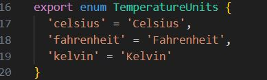
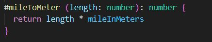

<h1>
Reflection L3 1DV610 - 2023
</h1>

## Table of Contents
1. [Meaningful Names](#1-chapter-2---meaningful-names)
2. [Functions](#2-chapter-3---functions)
3. [Comments](#3-chapter-4---comments)
4. [Formatting](#4-chapter-5---formatting)
5. [Objects and data structures](#5-chapter-6---objects-and-data-structures)
6. [Error handling](#6-chapter-7---error-handling)
7. [Boundaries](#7-chapter-8---boundaries)
8. [Unit tests](#8-chapter-9---unit-tests)
9. [Classes](#9-chapter-10---classes)
10. [Systems](#10-chapter-11---systems)

---

**Note:** 
It feels a bit awkward to include chapters that hasn't been included in any lectures. As of this writing there hasn't been any lecture on chapters 9 through 11 and onwards.

### 1. Chapter 2 - Meaningful names

I believe that choosing meaningful names is a foundational element of good coding practices. Finding the right names can be a difficult task, but it is crucial for enhancing code readability and maintainability. The time spent on carefully selecting names for methods, classes, and attributes is an investment that pays off in the long run. In my opinion, this attention to detail is invaluable for any programmer who aims for high-quality code.

In this example, the original name "TemperatureTypes" was replaced with "TemperatureUnits," which more accurately communicates both the intent and the content of the enumeration. This change enhances readability and makes the code more self-explanatory, thus aligning with best practices for naming conventions.

### 2. Chapter 3 - Functions

The book advocates that functions should perform only one task, have descriptive names, and ideally be niladic (having no arguments), the image below serves as a fitting example. Although the function illustrated does have one argument, making it monadic, nor does is it a nice verb/noun pair but it still is quite descriptive and it still adheres to the principles outlined in the book.

Contrary to the guidelines in book, I believe that a function performing only a single task can actually complicate code readability. This approach often leads to a cascade of method calls, requiring you to navigate through multiple functions before arriving at one that performs some form of action. Additionally, I also favor encapsulating multiple arguments into a single class, as I find this practice reduces the likelihood of errors and enhances code organization.

### 3. Chapter 4 - Comments

### 4. Chapter 5 - Formatting

### 5. Chapter 6 - Objects and data structures

### 6. Chapter 7 - Error handling

### 7. Chapter 8 - Boundaries

### 8. Chapter 9 - Unit Tests

### 9. Chapter 10 - Classes

### 10. Chapter 11 - Systems