<h1>
Test Report for Unit Converter App
</h1>

## Table of Contents
1. [Introduction](#1-introduction)
2. [Test Environment](#2-test-environment)
3. [Test Cases](#3-test-cases)
4. [Test Results](#4-test-results)
5. [Performance Testing](#5-performance-testing)
6. [Security Testing](#6-security-testing)
7. [Conclusion](#7-conclusion)
8. [Attachments](#8-attachments)
9. [Report Author](#9-test-report-author)

---

### 1. Introduction
This report aims to document the testing processes, methodologies, and outcomes for the Unit Converter App, ensuring that it meets the requirements specified in the Software Requirements Specification (SRS) and the project vision. The main focus is to validate the functional and non-functional requirements, assess usability, performance, and security aspects, and confirm that the app delivers an intuitive, efficient, and safe experience to its target audience.

---

### 2. Test Environment
- **Platform:** Web-based
- **Browser Compatibility:** Firefox
- **Frameworks:** React and NextJS
- **Languages:** TypeScript

---

### 3. Test Cases

#### Functional Testing
1. **Conversion Types**: Verify that users can select between 'Length' and 'Temperature' for conversions.
2. **Input**: Verify that users can input a numeric value.
3. **Unit Selection**: Verify the functionality of the unit selection via dropdown menus.
4. **Output**: Verify the converted value displays correctly.
5. **Auto-calculation**: Verify conversions are done automatically when any value or unit changes.

#### Non-Functional Testing
1. **Usability**: Evaluate the interface for intuitiveness.
2. **Performance**: Measure the time taken for real-time conversions.
3. **Security**: Validate input for conformity to numeric formats.

---

### 4. Test Results

#### Functional Test Results
1. **Conversion Types**: Passed
2. **Input**: Passed
3. **Unit Selection**: Passed
4. **Output**: Passed
5. **Auto-calculation**: Passed

#### Non-Functional Test Results
1. **Usability**: Passed
2. **Performance**: Passed
3. **Security**: Passed

[Test Video](https://youtu.be/gMfZf3Rrtac)

---

### 5. Performance Testing
The app has been tested for performance and demonstrated real-time conversions, conforming to the non-functional requirement of high performance.

---

### 6. Security Testing
All input fields were tested for common security vulnerabilities like SQL injection and cross-site scripting (XSS). The app successfully validated all inputs to conform to numeric formats, meeting the security requirements mentioned in the SRS.

---

### 7. Conclusions
The Unit Converter App successfully passed all functional and non-functional test cases. It adheres to the requirements set forth in the SRS document and aligns well with the project vision. The app is ready for deployment and is expected to serve its target audience effectively and securely.

### 8. Attachments
##### Base
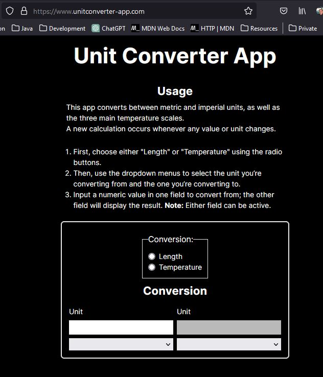

##### Select Conversion type
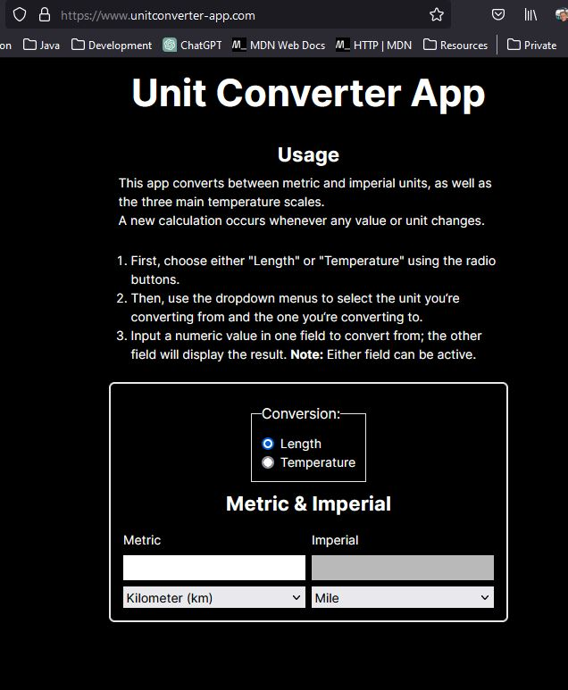
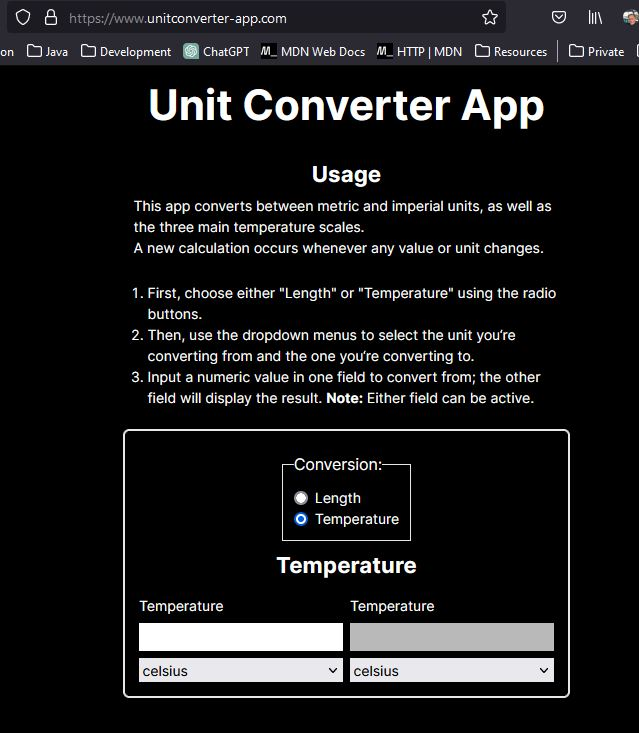

##### Input numeric value
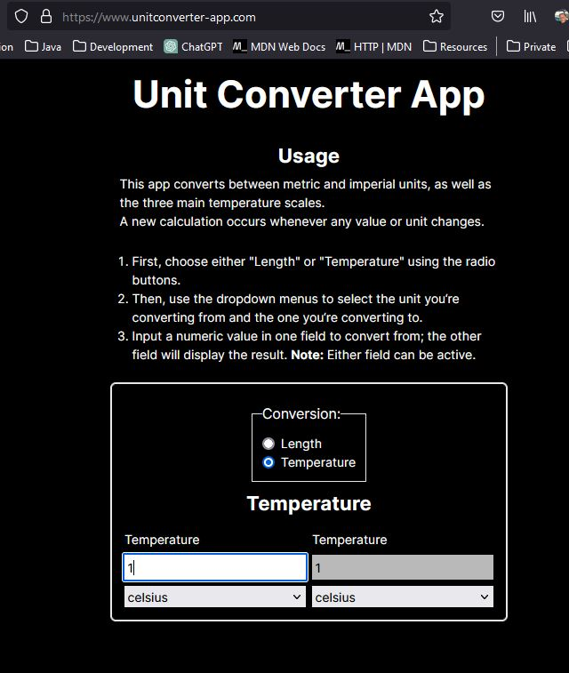

##### Input none-numeric value
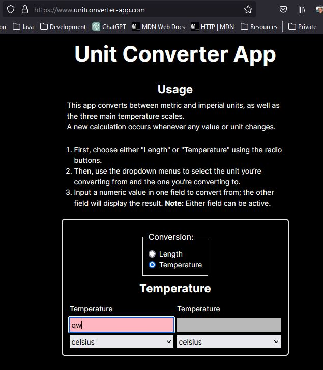

##### Dropdown Menus
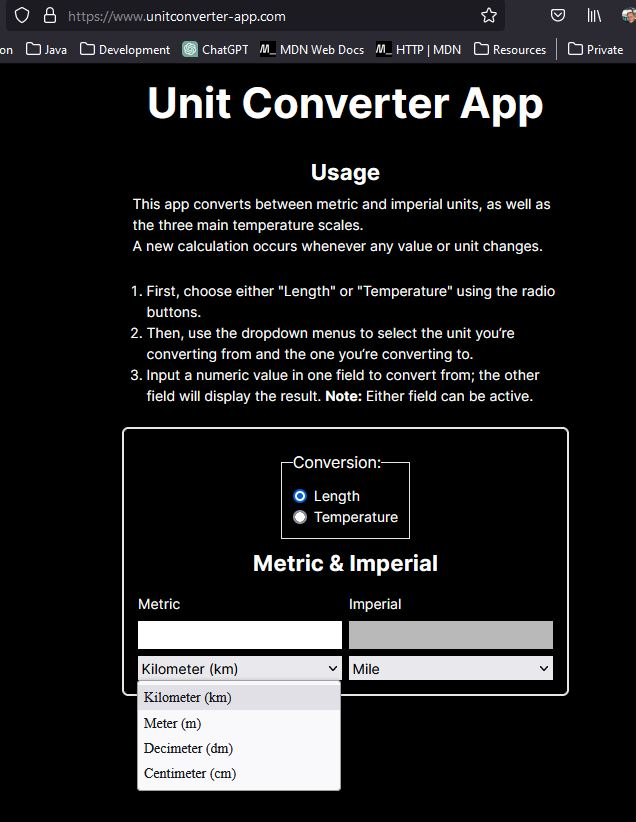
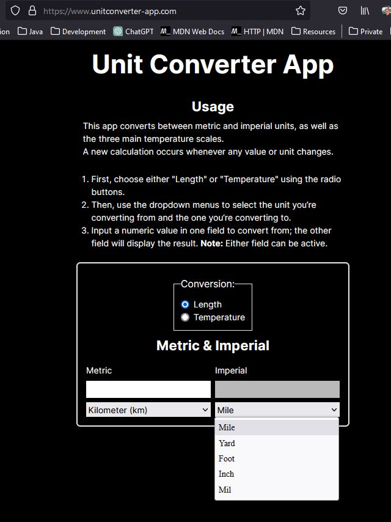
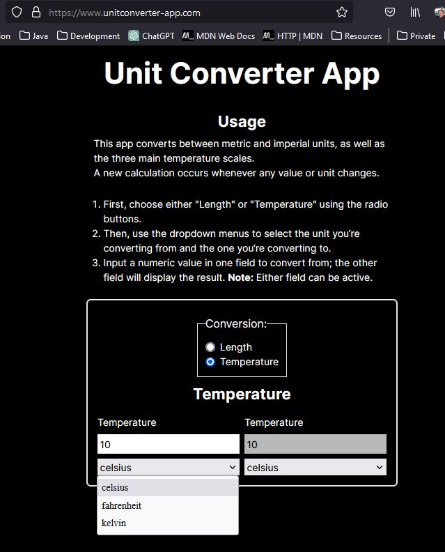
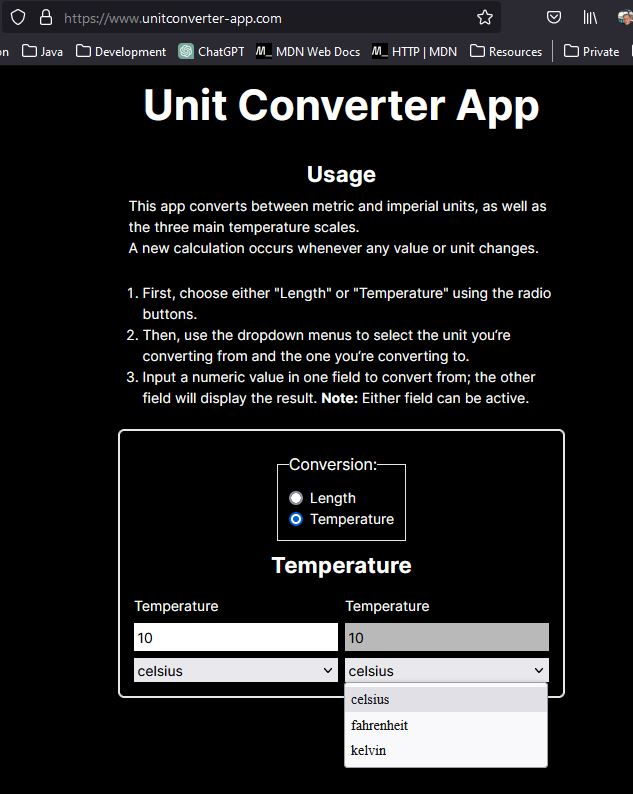

##### Correct calculations
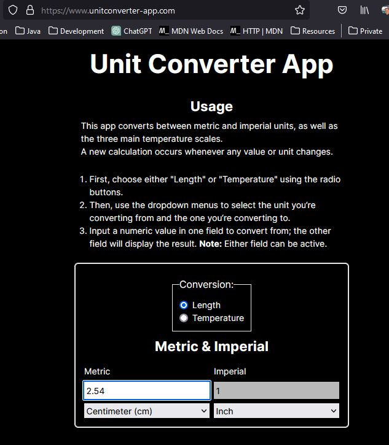
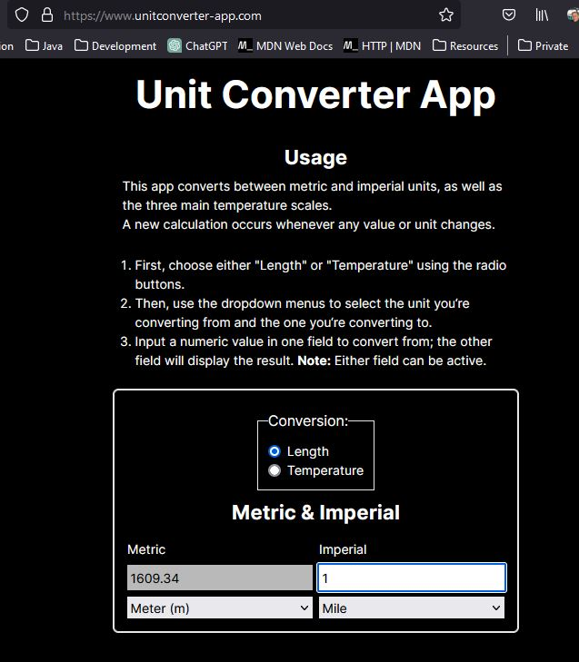
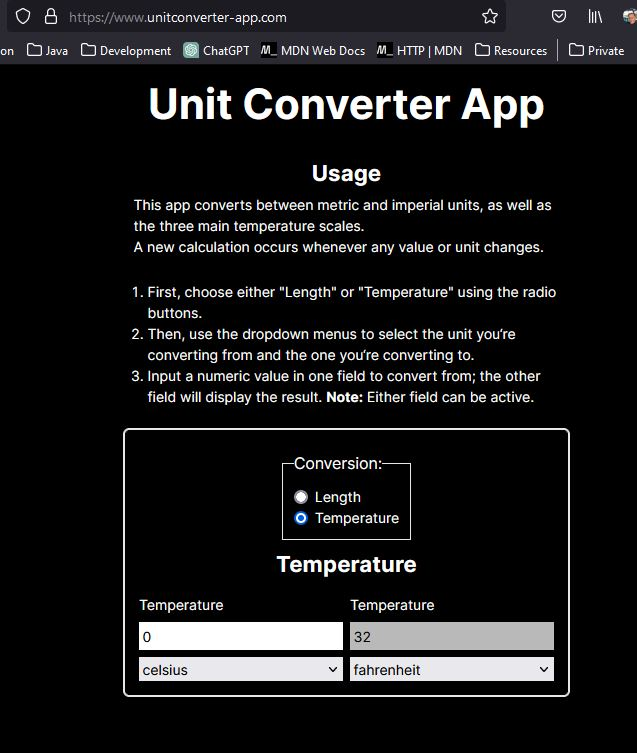
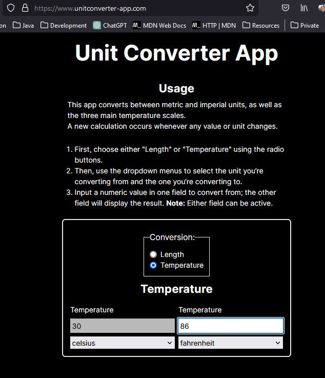

### 9. Test Report Author
**Chris Johannesson <chris@chrisjohannesson.com>**
